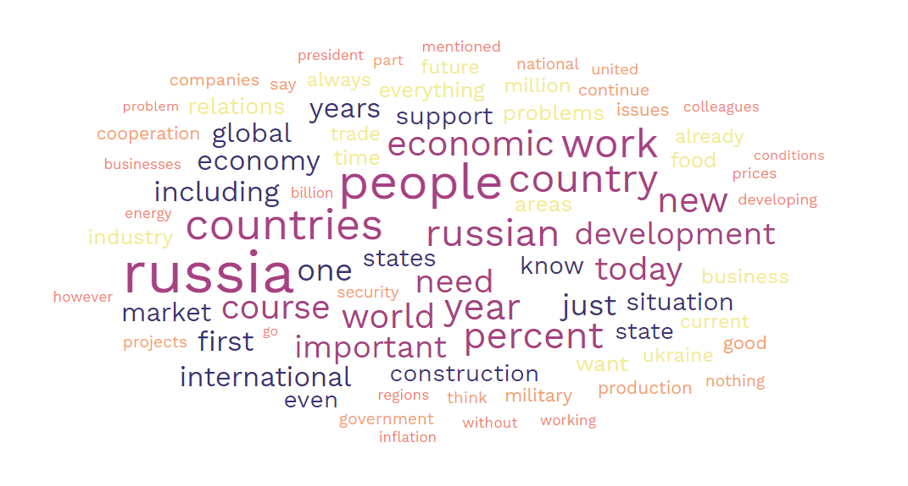

# PutinSentimentAnalysis

**“But if thought corrupts language, language can also corrupt thought.” ― George Orwell, 1984**  

More recently, the Russian invasion of Ukraine has been a global trending topic, sparking conversation about what the future may hold in a troubling time for millions of humans.
At the head of this attack, the words that President Putin speak carry a certain weight that impacts not only Ukraine and Russia, but countries around the world. 

## Table of Contents
* [General Info](#general-information)
* [Analysis](#Analysis)
* [Technologies Used](#technologies-used)
* [Screenshots](#screenshots)
* [Usage](#usage)
* [Acknowledgements](#acknowledgements)
* [Contact](#contact)
<!-- * [License](#license) -->

## General Information
- Sentiment analysis, often known as opinion mining, is a natural language processing (NLP) method for identifying the positivity, negativity, or neutrality of data

- The Lexicon Sentiment analysis originally was developed by UIC PhD Bing Liu and associates to "mine and to summarize online opinions in reviews, tweets, blogs, forum discussions, etc. Specifically, features or aspects of entities (e.g., products) or topics on which people have expressed their opinions and determine whether the opinions are positive or negative." Original Study/Algorithm - [Original Sentiment Analysis](https://www.cs.uic.edu/~liub/FBS/sentiment-analysis.html)  

- Inspiration for this independent project came from a r/dataisbeautiful post, it can be found 
[here](https://www.reddit.com/r/dataisbeautiful/comments/vn4khn/oc_seinfeld_characters_average_sentiment_score_by/)

Lexicon meanings:
Click [here](https://emilhvitfeldt.github.io/textdata/index.html) to see included text datasets for each lexicon

## Analysis
- With the help of these natural language processing tools, my partner and I were able to measure the emotion in each public speech. Sentiment lexicons are important resources needed for this project to improve the efficiency of our sentiment analyses

- Our initial analysis began with gathering all of the public speech transcript data of Vladimir Putin since the 24th of February, after Russia launched its full-scale military aggression against Ukraine. We webscraped [The Kremlin](http://en.kremlin.ru/events/president/transcripts/by-date/10.06.2022) in order to gather each individual speech by date into a dataset, then, by joining each individual dataset, we were able to create a 'MonthlyWhole' dataset containing every speech from the month in which it took place
- This transcript analysis gave us the text data needed to process each individual word (unigrams) into a numeric score based off of the sentiment datasets

- Within the tidytext package, there is access to three different lexicons used to produce different results:

The nrc lexicon categorizes words in a binary fashion (“yes”/“no”) into categories of positive, negative, anger, disgust, fear, joy, sadness, surprise, and trust  

The bing lexicon categorizes words in a binary fashion into positive and negative categories  

The afinn lexicon assigns words with a score that runs between -5 and 5, with negative scores indicating negative sentiment and positive scores indicating positive  sentiment  

We chose the nrc lexicon for our overall analysis over the 'afinn' and 'bing' lexicon for various reasons. One main factor being size of the dataset, afinn was only limited to 2,477 English words within the dataset, and bing only 6,786. With nrc, the 13,901 characters made it clear that with an expanded dataset, we would be able to achieve scores with higher accuracy

- After focusing our analysis on the realtionship between Putin's sentiment score and the civilian death toll in Ukraine

We found that there was a positive correlation to the death change and high sentiment score, meaning that in the instances where the civilian death rate had increased, Putin's speeches at that time were drastically increased in postive sentiment, April 20th being the strongest outlier **Screenshot 3 for visualization** 

- We wanted to know if there is a specific correlation between outlier scores in public speeches where Putin recieved a negative/positive sentiment score and further acts of aggression upon the democratic state **Screenshots 2 & 3** 

- What are the most used words that from each month since the beginning of the invasion **Screenshots 5-9**

- Average change in civilian causulties to sentiment score **Screenshot 10**

## Technologies Used
- R - v2022.02.2+485
- RStudio - v2022.02.2+485
- Python 3.10.5 v2022.06.05
- Tableau Desktop v2022.2

- https://www.tidytextmining.com/sentiment.html

- Data Sets
remotes:install_github("EmilHvitfeldt/textdata")  

- https://www.statista.com/statistics/1296924/ukraine-war-casualties-daily/

- Lexicons 
lexicon_bing()  
lexicon_afinn()  
lexicon_nrc() **Most Frequently Used Lexicon**

[Original LexiCon Analysis](https://www.cs.uic.edu/~liub/FBS/sentiment-analysis.html#lexicon)  
[Original Tutorial](https://www.cs.uic.edu/~liub/FBS/Sentiment-Analysis-tutorial-AAAI-2011.pdf)  

## Screenshots
We created these visualzations in R and Tableau in order to see if there could be any correlations  
 
- **SC1 - 5 month total combined sentiment score to casualties (below)**
 
- **SC2 - Negative sentiment score outliers to civilian death toll (below)**

- **SC3 - Positive sentiment score outliers to civilian death toll (below)**

- **SC4 - Civilian casualty to sentiment score visualization**

- **SC5 - text WordCloud from every transcript from the month of February (below)**
  
- **SC6 - text WordCloud from every transcript from the month of March (below)**
  
- **SC7 - text WordCloud from every transcript from the month of April (below)**
  
- **SC8 - text WordCloud from every transcript from the month of May (below)**
  
- **SC9 - text WordCloud from every transcript from the month of June (below)**
  
- **SC10 - Average change in all data (killed, death change, injured, injured change) to sentiment score (below)**
  

## Usage
See 'PutinSentAnalysis.R' in 'Code' to see our entire R file with comments on usage  

## Acknowledgements
- Many thanks to the inspiration for this project as well as original developers for sharing code

## Contact
Created by [@cadekeenan]  
Created by [@timcookk]  

 - feel free to contact me via twitter in bio!
